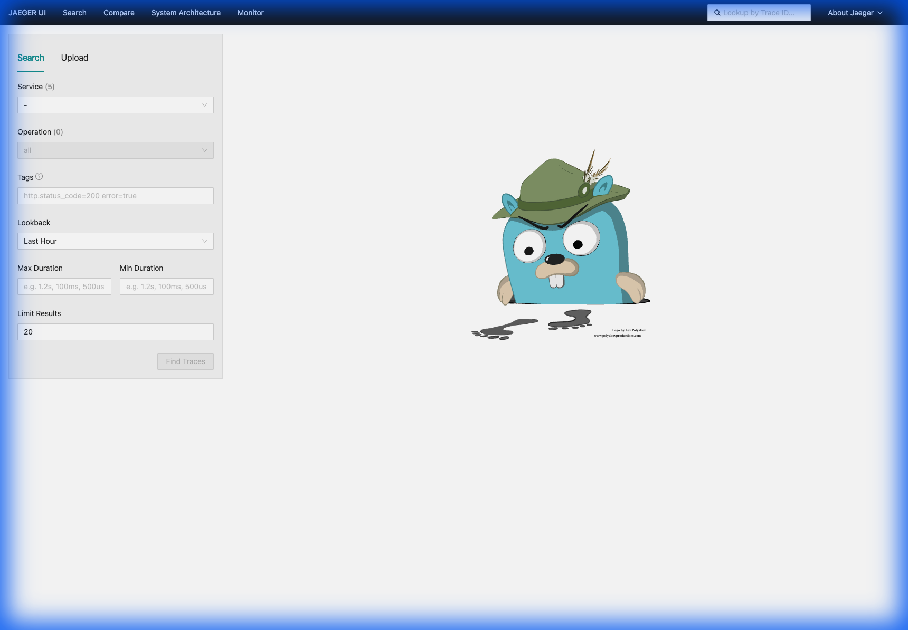
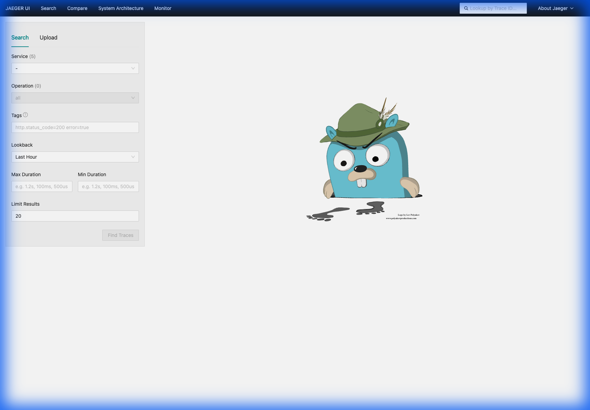
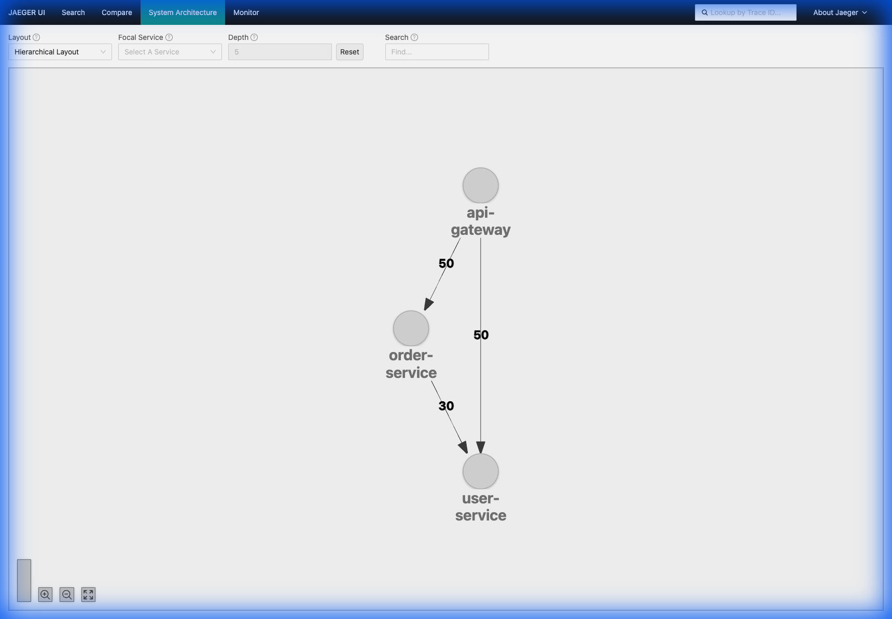
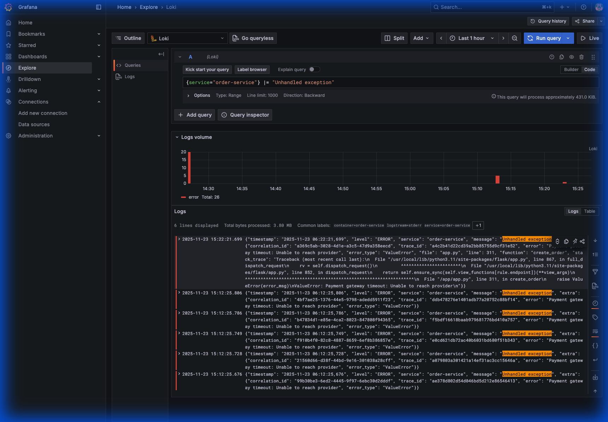
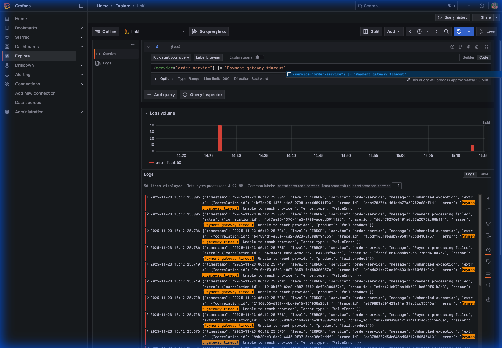
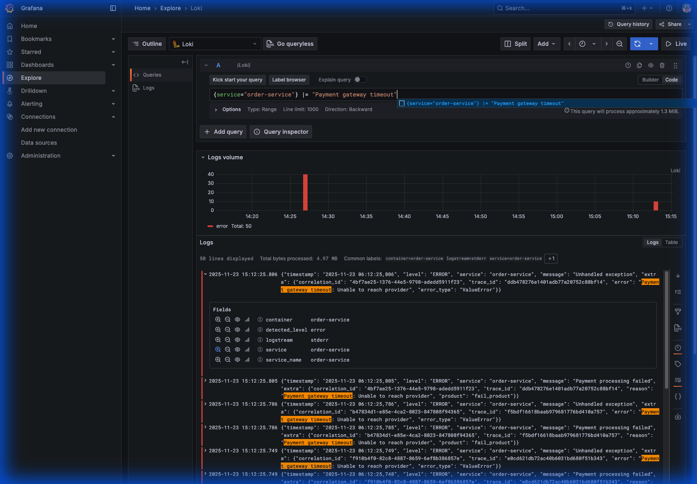

# The Complete Guide to Distributed Observability
## From Zero to Production-Ready Monitoring

**A Comprehensive, End-to-End Tutorial on Building Observable Microservices**

---

## Table of Contents

1. [Introduction: What is Observability?](#1-introduction-what-is-observability)
2. [The Three Pillars of Observability](#2-the-three-pillars-of-observability)
3. [Pillar 1: Structured Logging](#3-pillar-1-structured-logging)
4. [Pillar 2: Metrics and Monitoring](#4-pillar-2-metrics-and-monitoring)
5. [Pillar 3: Distributed Tracing](#5-pillar-3-distributed-tracing)
6. [Centralized Log Aggregation with Loki](#6-centralized-log-aggregation-with-loki)
7. [Advanced Tracing with Jaeger](#7-advanced-tracing-with-jaeger)
8. [Finding Exact Error Locations](#8-finding-exact-error-locations)
9. [The Complete Debugging Workflow](#9-the-complete-debugging-workflow)
10. [Production Best Practices](#10-production-best-practices)
11. [Quick Reference](#11-quick-reference)

---

## 1. Introduction: What is Observability?

### 1.1 Definition

**Observability** is the ability to understand the internal state of a system by examining its external outputs. In distributed systems, this means answering questions like:

- "Why is this API endpoint slow?"
- "Which service is causing errors?"
- "What happened during the outage at 2 AM?"
- "How does a request flow through our system?"

### 1.2 Observability vs Monitoring

| Aspect | Monitoring | Observability |
|--------|-----------|---------------|
| **Focus** | Known problems | Unknown problems |
| **Approach** | Predefined dashboards and alerts | Exploratory investigation |
| **Questions** | "Is the system up?" | "Why is it behaving this way?" |
| **Tools** | Health checks, uptime monitors | Logs, metrics, traces |
| **Mindset** | Reactive | Proactive |

**Example:**

**Monitoring** tells you: "API response time is 5 seconds (threshold: 1 second) ⚠️"

**Observability** helps you discover:
- Which specific endpoint is slow?
- Is it slow for all users or specific ones?
- Which downstream service is the bottleneck?
- What changed recently that could cause this?

### 1.3 Why Observability Matters in Distributed Systems

Modern applications are distributed across multiple services. This creates challenges:

**Without Observability:**
- No visibility into service interactions
- Difficult debugging across service boundaries
- Slow incident response due to lack of context
- Blind spots in performance bottlenecks

**With Observability:**
- ✅ Faster debugging - Quickly identify root causes
- ✅ Better reliability - Detect issues before users do
- ✅ Improved performance - Find and fix bottlenecks
- ✅ Data-driven decisions - Understand actual usage patterns
- ✅ Reduced MTTR (Mean Time To Resolution)

---

## 2. The Three Pillars of Observability

Observability is built on three fundamental data types that work together to give you complete visibility.

### 2.1 Pillar Overview

| Pillar | Data Type | Purpose | Example |
|--------|-----------|---------|---------|
| **📝 Logs** | Timestamped events | What happened? | "User 123 failed to login: Invalid password" |
| **📊 Metrics** | Numerical measurements | How much/How often? | "Error rate: 5%, P95 latency: 250ms" |
| **🔍 Traces** | Request journeys | Where/Which service? | "Request spent 2.8s in Payment Service" |

### 2.2 Why You Need All Three

Each pillar answers different questions:

| Question | Best Answered By |
|----------|------------------|
| "Is the system healthy?" | **Metrics** |
| "What's the error rate trend?" | **Metrics** |
| "Why did this specific request fail?" | **Logs** + **Traces** |
| "Which service is slow?" | **Traces** |
| "What was the user doing when it failed?" | **Logs** |
| "How do our services interact?" | **Traces** |

### 2.3 Real-World Example: Slow Checkout

**Scenario:** Users report slow checkout

1. **Metrics** show: Order service latency p95 is 3 seconds (normally 200ms)
2. **Traces** reveal: Payment API calls are taking 2.8 seconds
3. **Logs** show: Payment API returning "rate limit exceeded" errors

**Root Cause:** Payment provider rate limiting. **Solution:** Implement retry with backoff.

### 2.4 The Rakuten E-Commerce Analogy

Imagine you're an SRE at **Rakuten Ichiba** during a huge "Super Sale":

**Pillar 1: Metrics (Prometheus)**
- **Question**: "Is the system healthy?"
- **Alert**: "Order Service Error Rate is > 5%"
- **Graph**: You see a red spike. 500 out of 10,000 orders per minute are failing
- **Limitation**: Tells you **THAT** something is wrong and **WHEN**, not **WHY**

**Pillar 2: Distributed Tracing (Jaeger)**
- **Question**: "Where is the problem?"
- **Visual**: Path: `Mobile App` → `API Gateway` → `Order Service` → `Payment Service`
- **Finding**: The `Payment Service` bar is red and took 10 seconds before timing out
- **Limitation**: Tells you **WHERE** the bottleneck is, not **WHAT** the specific error was

**Pillar 3: Logs (Loki)**
- **Question**: "What exactly happened?"
- **Query**: `{service="payment-service"} |= "error"`
- **Result**: `[Error] Connection timeout: Unable to reach external Credit Card Provider API`
- **Conclusion**: The external banking API is down. It's not a code bug; it's a vendor outage

---

## 3. Pillar 1: Structured Logging

### 3.1 Structured vs Unstructured Logging

#### Unstructured Logging ❌

```python
print("User alice@example.com created order 123 for $99.99")
```

**Problems:**
- Hard to parse programmatically
- Difficult to search and filter
- No consistent format
- Can't aggregate or analyze

#### Structured Logging ✅

```python
logger.info("Order created", extra={
    "event": "order_created",
    "user_email": "alice@example.com",
    "order_id": 123,
    "amount": 99.99,
    "currency": "USD"
})
```

**Output (JSON):**
```json
{
  "timestamp": "2025-11-23T06:00:00Z",
  "level": "INFO",
  "message": "Order created",
  "event": "order_created",
  "user_email": "alice@example.com",
  "order_id": 123,
  "amount": 99.99,
  "currency": "USD",
  "service": "order-service",
  "trace_id": "abc123"
}
```

**Benefits:**
- ✅ Easy to search: `event="order_created" AND amount > 50`
- ✅ Aggregatable: "How many orders created today?"
- ✅ Consistent format across services
- ✅ Machine-readable

### 3.2 Log Levels

| Level | When to Use | Example |
|-------|-------------|---------|
| **DEBUG** | Detailed diagnostic info | "SQL query: SELECT * FROM users WHERE id=123" |
| **INFO** | General informational events | "User logged in successfully" |
| **WARNING** | Something unexpected but handled | "API rate limit approaching (80% used)" |
| **ERROR** | Error that affects functionality | "Failed to save order to database" |
| **CRITICAL** | System-level failures | "Database connection pool exhausted" |

### 3.3 Best Practices

#### 1. Include Context

```python
# ❌ Not enough context
logger.error("Save failed")

# ✅ Rich context
logger.error("Failed to save user to database", extra={
    "user_id": user.id,
    "operation": "create_user",
    "error": str(e),
    "retry_count": retry_count
})
```

#### 2. Use Correlation IDs

Link related logs across services:

```python
# Generate or extract correlation ID
correlation_id = request.headers.get('X-Correlation-ID') or str(uuid.uuid4())

# Include in all logs
logger.info("Processing request", extra={
    "correlation_id": correlation_id,
    "endpoint": request.path
})

# Pass to downstream services
response = requests.post(url, 
    headers={"X-Correlation-ID": correlation_id},
    json=data
)
```

#### 3. Log at Service Boundaries

Always log when entering/exiting your service:

```python
@app.before_request
def log_request():
    logger.info("Incoming request", extra={
        "method": request.method,
        "path": request.path,
        "correlation_id": g.correlation_id
    })

@app.after_request
def log_response(response):
    logger.info("Outgoing response", extra={
        "status_code": response.status_code,
        "correlation_id": g.correlation_id
    })
    return response
```

#### 4. Don't Log Sensitive Data

```python
# ❌ Logging sensitive data
logger.info("User login", extra={
    "email": user.email,
    "password": user.password  # NEVER!
})

# ✅ Redact or omit sensitive fields
logger.info("User login", extra={
    "email": user.email,
    "user_id": user.id
})
```

#### 5. Use Consistent Field Names

```python
# Standard fields
STANDARD_FIELDS = {
    "user_id": "user_id",      # Not "userId" or "user"
    "order_id": "order_id",    # Not "orderId" or "id"
    "trace_id": "trace_id",    # Not "traceId" or "trace"
}
```

### 3.4 What to Log

#### ✅ DO Log
- Service startup/shutdown
- Incoming requests
- Outgoing requests to other services
- Business events (order created, user registered)
- Errors and exceptions
- Performance warnings
- Configuration changes

#### ❌ DON'T Log
- Passwords or secrets
- Credit card numbers
- Personal identifiable information (PII) without redaction
- Excessive debug info in production
- Every single database query (use sampling)

---

## 4. Pillar 2: Metrics and Monitoring

### 4.1 Why Metrics?

**Logs** answer: "What happened to request XYZ?"  
**Metrics** answer: "How is the system performing overall?"

Instead of reading 10,000 log lines, check one metric:
```
http_requests_total{status="500"} / http_requests_total = 0.02  # 2% error rate
```

### 4.2 Types of Metrics

#### 1. Counter

A value that only **increases** (or resets to zero).

**Examples:**
- Total HTTP requests
- Total errors
- Total orders processed

```python
from prometheus_client import Counter

http_requests_total = Counter(
    'http_requests_total',
    'Total HTTP requests',
    ['method', 'endpoint', 'status']
)

# Increment the counter
http_requests_total.labels(method='GET', endpoint='/users', status='200').inc()
```

**Prometheus Query:**
```promql
# Rate of requests per second
rate(http_requests_total[5m])

# Total requests in last hour
increase(http_requests_total[1h])
```

#### 2. Gauge

A value that can **go up or down**.

**Examples:**
- Current memory usage
- Number of active connections
- Queue size

```python
from prometheus_client import Gauge

active_connections = Gauge(
    'active_connections',
    'Number of active connections',
    ['service']
)

# Set the gauge
active_connections.labels(service='user-service').set(42)

# Increment/decrement
active_connections.labels(service='user-service').inc()
active_connections.labels(service='user-service').dec()
```

#### 3. Histogram

Tracks the **distribution** of values (e.g., request durations).

**Examples:**
- Request latency
- Response size
- Query duration

```python
from prometheus_client import Histogram

http_request_duration_seconds = Histogram(
    'http_request_duration_seconds',
    'HTTP request duration in seconds',
    ['method', 'endpoint'],
    buckets=[0.1, 0.5, 1.0, 2.0, 5.0]
)

# Observe a value
with http_request_duration_seconds.labels(method='GET', endpoint='/users').time():
    process_request()
```

**Prometheus Query:**
```promql
# 95th percentile latency
histogram_quantile(0.95, rate(http_request_duration_seconds_bucket[5m]))

# Average latency
rate(http_request_duration_seconds_sum[5m]) / rate(http_request_duration_seconds_count[5m])
```

### 4.3 The RED Method

A simple framework for monitoring services:

#### **R**ate
How many requests per second?
```promql
rate(http_requests_total[5m])
```

#### **E**rrors
How many requests are failing?
```promql
rate(http_requests_total{status=~"5.."}[5m])
```

#### **D**uration
How long do requests take?
```promql
histogram_quantile(0.95, rate(http_request_duration_seconds_bucket[5m]))
```

### 4.4 Metric Labels

Labels add dimensions to metrics:

```python
http_requests_total.labels(
    method='POST',
    endpoint='/orders',
    status='201'
).inc()
```

**Result:**
```
http_requests_total{method="POST", endpoint="/orders", status="201"} 1543
```

#### Label Best Practices

**✅ Good Labels (Low Cardinality)**
```python
http_requests_total.labels(
    method='GET',           # ~10 values
    endpoint='/users',      # ~50 values
    status='200'           # ~10 values
)
```

**❌ Bad Labels (High Cardinality)**
```python
http_requests_total.labels(
    user_id='12345',       # Millions of values ❌
    request_id='abc-123',  # Infinite values ❌
    timestamp='2025-11-21' # Infinite values ❌
)
```

**Why?** High cardinality causes:
- Memory exhaustion
- Slow queries
- Storage issues

### 4.5 Common Metrics to Track

#### Application Metrics
- Request rate
- Error rate
- Request duration
- Active connections
- Queue size

#### Business Metrics
- Orders created
- Users registered
- Revenue generated
- Feature usage

#### System Metrics
- CPU usage
- Memory usage
- Disk I/O
- Network traffic

---

## 5. Pillar 3: Distributed Tracing

### 5.1 What is a Trace?

A **trace** represents the complete journey of a request through your system.

**Example: Creating an Order**
```
User Request → API Gateway → Order Service → User Service → Database
```

Without tracing, you'd need to:
1. Check API Gateway logs
2. Find the correlation ID
3. Search Order Service logs
4. Search User Service logs
5. Piece everything together manually

**With tracing, you see the entire flow in one view!**

### 5.2 Key Concepts

#### Trace
The complete journey of a request.
- **Trace ID:** `abc-123-def` (unique identifier)

#### Span
A single operation within a trace.

**Example Spans:**
- "HTTP GET /orders"
- "Database query: SELECT * FROM users"
- "Call to payment service"

#### Parent-Child Relationships

Spans form a tree structure:
```
Trace: abc-123-def
│
├─ Span: API Gateway [100ms]
   │
   ├─ Span: Order Service [80ms]
      │
      ├─ Span: User Service [30ms]
      │  └─ Span: DB Query [20ms]
      │
      └─ Span: Inventory Service [40ms]
         └─ Span: DB Query [25ms]
```

#### Span Attributes

Metadata attached to spans:
```python
{
    "http.method": "POST",
    "http.url": "/orders",
    "http.status_code": 201,
    "user.id": "12345",
    "order.id": "67890"
}
```

#### Context Propagation

Passing trace context between services:
```
Service A → Service B
   │           │
   └─ Headers ─┘
      Trace-ID: abc-123
      Span-ID: span-456
```

### 5.3 OpenTelemetry Implementation

#### Basic Setup

```python
from opentelemetry import trace
from opentelemetry.sdk.trace import TracerProvider
from opentelemetry.sdk.trace.export import BatchSpanProcessor
from opentelemetry.exporter.otlp.proto.grpc.trace_exporter import OTLPSpanExporter
from opentelemetry.sdk.resources import Resource
from opentelemetry.instrumentation.flask import FlaskInstrumentor

# Define service name
resource = Resource(attributes={
    "service.name": "api-gateway"
})

# Create tracer provider
trace.set_tracer_provider(TracerProvider(resource=resource))
tracer = trace.get_tracer(__name__)

# Configure OTLP exporter
otlp_exporter = OTLPSpanExporter(endpoint="http://jaeger:4317", insecure=True)
trace.get_tracer_provider().add_span_processor(BatchSpanProcessor(otlp_exporter))

# Auto-instrument Flask
FlaskInstrumentor().instrument_app(app)
```

#### Creating Spans

**Automatic Instrumentation:**
```python
# This automatically creates a span!
@app.route('/users/<user_id>')
def get_user(user_id):
    return jsonify(fetch_user(user_id))
```

**Manual Spans:**
```python
@app.route('/orders', methods=['POST'])
def create_order():
    with tracer.start_as_current_span("create_order") as span:
        # Add attributes
        span.set_attribute("order.product", request.json['product'])
        span.set_attribute("order.quantity", request.json['quantity'])
        
        # Your business logic
        order = process_order(request.json)
        
        # Add more attributes
        span.set_attribute("order.id", order.id)
        span.set_attribute("order.total", order.total)
        
        return jsonify(order), 201
```

**Nested Spans:**
```python
with tracer.start_as_current_span("process_order") as parent_span:
    parent_span.set_attribute("order.id", order_id)
    
    with tracer.start_as_current_span("validate_inventory"):
        check_inventory(order.items)
    
    with tracer.start_as_current_span("calculate_total"):
        total = calculate_total(order.items)
    
    with tracer.start_as_current_span("save_to_database"):
        db.save(order)
```

#### Recording Errors

```python
from opentelemetry.trace import Status, StatusCode

with tracer.start_as_current_span("risky_operation") as span:
    try:
        result = risky_operation()
    except Exception as e:
        span.record_exception(e)
        span.set_status(Status(StatusCode.ERROR, str(e)))
        raise
```

### 5.4 Context Propagation Flow

**Step 1: User sends request**
```bash
curl -X POST http://localhost:8080/orders \
  -H "Content-Type: application/json" \
  -d '{"user_id": "1", "product": "laptop", "quantity": 1}'
```

**Step 2: API Gateway creates root span**
```python
# Trace ID: abc123 (generated)
# Span ID: span-001
# Operation: POST /orders
```

**Step 3: API Gateway calls Order Service**
```python
# OpenTelemetry injects headers:
headers = {
    'X-B3-TraceId': 'abc123',        # Same trace!
    'X-B3-ParentSpanId': 'span-001'  # Parent is API Gateway
}
requests.post('http://order-service:8002/orders', headers=headers, json=data)
```

**Step 4: Order Service creates child span**
```python
# Trace ID: abc123 (inherited)
# Span ID: span-002 (new)
# Parent Span ID: span-001
```

**Step 5: Order Service calls User Service**
```python
headers = {
    'X-B3-TraceId': 'abc123',        # Still the same trace!
    'X-B3-ParentSpanId': 'span-002'  # Parent is now Order Service
}
requests.get('http://user-service:8001/users/1', headers=headers)
```

**Result:** All spans share the same **Trace ID** (`abc123`). Jaeger groups them together and displays them as a single trace.

---

## 6. Centralized Log Aggregation with Loki

### 6.1 The Problem

Without centralized logging:
1. **Fragmented Data**: Logs are isolated in `docker logs <container_id>`
2. **No Correlation**: Hard to match a spike in error metrics with actual error logs
3. **Transient Logs**: If a container crashes and is removed, its logs are lost

### 6.2 The Solution: PLG Stack

**Promtail, Loki, Grafana**

#### What is Loki?
**Loki** is a horizontally scalable, highly available, multi-tenant log aggregation system inspired by Prometheus.

- **"Prometheus for Logs"**: Doesn't index log contents, only labels
- **Storage**: Stores compressed, unstructured logs in object storage
- **Cost-Effective**: Much cheaper than ELK (Elasticsearch)

#### What is Promtail?
**Promtail** is an agent which ships local logs to Loki.

- **Role**: Discovers targets (Docker containers), attaches labels, pushes to Loki
- **In our project**: Reads from Docker socket, ships all container logs to Loki

### 6.3 Implementation

#### Docker Compose Configuration

```yaml
# Loki - Log Aggregation
loki:
  image: grafana/loki:latest
  container_name: loki
  ports:
    - "3100:3100"
  volumes:
    - ./loki/loki-config.yml:/etc/loki/local-config.yaml
  command: -config.file=/etc/loki/local-config.yaml

# Promtail - Log Collector
promtail:
  image: grafana/promtail:latest
  container_name: promtail
  volumes:
    - ./promtail/promtail-config.yml:/etc/promtail/config.yml
    - /var/run/docker.sock:/var/run/docker.sock
  command: -config.file=/etc/promtail/config.yml
```

#### Promtail Configuration

```yaml
server:
  http_listen_port: 9080

clients:
  - url: http://loki:3100/loki/api/v1/push

scrape_configs:
  - job_name: docker
    docker_sd_configs:
      - host: unix:///var/run/docker.sock
        refresh_interval: 5s
    relabel_configs:
      - source_labels: ['__meta_docker_container_name']
        regex: '/(.*)'
        target_label: 'container'
      - source_labels: ['__meta_docker_container_label_com_docker_compose_service']
        target_label: 'service'
```

### 6.4 Querying Logs with LogQL

**Basic Queries:**
```logql
# All logs from order-service
{service="order-service"}

# Error logs from any service
{service=~".+"} |= "error"

# POST requests in the last hour
{service=~".+"} |= "POST" [1h]

# Count errors by service
sum(count_over_time({service=~".+"} |= "error" [1h])) by (service)
```

**Advanced Queries:**
```logql
# Logs with specific trace ID
{service="order-service"} |= "trace_id=abc123"

# Logs matching regex pattern
{service="order-service"} |~ "timeout|error|failed"

# JSON field extraction
{service="order-service"} | json | user_id="123"
```

### 6.5 Advantages of Loki

1. **Cost**: Doesn't index full text, only labels (much cheaper than ELK)
2. **Integration**: Same UI (Grafana) and query style (LogQL ~ PromQL)
3. **Metadata Awareness**: Automatically indexes container/pod metadata
4. **Scalability**: Horizontally scalable for large deployments

---

## 7. Advanced Tracing with Jaeger

### 7.1 Why Jaeger is Needed

| Problem | Without Tracing | With Jaeger |
|---------|----------------|-------------|
| **Slow Request** | "The API is slow" | "Order Service took 4.8s out of 5s total" |
| **Error Debugging** | Check logs in 10 services | See exact span where error occurred |
| **Service Dependencies** | Manual documentation | Auto-generated dependency graph |
| **Performance Regression** | "It was faster last week" | Compare trace durations over time |

### 7.2 Reading the Jaeger UI

#### Trace Waterfall View



**What you see:**
- **Horizontal bars**: Each bar is a span (an operation)
- **Length of bar**: Duration of that operation
- **Nesting**: Child spans are indented under their parent
- **Colors**: Different services have different colors

**Reading the trace:**
1. Top span: Entry point (`POST /orders` at API Gateway)
2. Second level: Proxy call to Order Service
3. Third level: Order Service calling User Service to validate user
4. Fourth level: Database query or business logic

**If one bar is significantly longer than others, that's your bottleneck!**

#### Span Details



**Key information:**
- **Tags**: `http.method=POST`, `http.status_code=201`, `user.id=1`
- **Process**: Which service and instance created this span
- **Logs**: Events that happened during this span
- **Duration**: Exact timing information

#### Service Dependencies



**What it shows:**
- **Nodes**: Each circle is a service
- **Arrows**: Direction of calls (e.g., API Gateway → Order Service)
- **Numbers**: Request count or error rate

**This is auto-generated from your traces—no manual documentation needed!**

### 7.3 Finding Issues with Jaeger

#### Finding Slow Requests
1. Go to Jaeger UI
2. Set "Min Duration" to 1s
3. Find traces taking longer than expected
4. Identify the slowest span
5. Optimize that operation

#### Finding Errors
1. Search with tag: `error=true`
2. Or: `http.status_code=500`
3. Look at span events and exceptions
4. Trace back to the root cause

#### Understanding Dependencies
1. View the trace timeline
2. See which services call which
3. Identify critical paths
4. Find unnecessary calls

---

## 8. Finding Exact Error Locations

### 8.1 The Problem

When you see an error log:
```json
{
  "error": "Payment gateway timeout: Unable to reach provider",
  "error_type": "ValueError",
  "service": "order-service"
}
```

**How do you know which file and which line of code caused it?**

### 8.2 The Solution: Enhanced Error Logging

We enhanced our error handler to automatically capture:
- **File name** - Which Python file the error occurred in
- **Line number** - The exact line that raised the exception
- **Function name** - Which function was executing
- **Stack trace** - The complete call stack

#### Implementation

```python
@app.errorhandler(Exception)
def handle_error(error):
    """Global error handler"""
    import traceback
    
    # Record exception in trace
    span = trace.get_current_span()
    if span:
        span.record_exception(error)
        span.set_attribute("error", True)
    
    # Extract file location from stack trace
    tb = traceback.extract_tb(error.__traceback__)
    if tb:
        last_frame = tb[-1]  # Where the error actually occurred
        file_name = last_frame.filename.split('/')[-1]
        line_number = last_frame.lineno
        function_name = last_frame.name
    else:
        file_name = "unknown"
        line_number = 0
        function_name = "unknown"
    
    # Log with complete context
    log_with_context(
        logging.ERROR,
        "Unhandled exception",
        error=str(error),
        error_type=type(error).__name__,
        file=file_name,           # NEW: File name
        line=line_number,          # NEW: Line number
        function=function_name,    # NEW: Function name
        stack_trace=traceback.format_exc()  # NEW: Full stack trace
    )
    
    return jsonify({"error": "Internal server error"}), 500
```

### 8.3 Viewing Enhanced Logs



**What the screenshot shows:**
1. **file: "app.py"** - The error occurred in the `app.py` file
2. **line: 311** - Specifically at line 311
3. **function: "create_order"** - Inside the `create_order` function
4. **stack_trace** - The complete call stack

### 8.4 The Impact

| Before Enhancement | After Enhancement |
|-------------------|-------------------|
| "Error in order-service" | "Error in `app.py` line 311" |
| Search entire codebase | Open file directly |
| Guess and check | Know immediately |
| Hours to debug | Minutes to debug |

---

## 9. The Complete Debugging Workflow

### 9.1 The Scenario: Payment Gateway Timeout

We simulated a real-world failure where ordering `fail_product` causes a "Payment gateway timeout" error.

### 9.2 Step-by-Step Debugging

#### Step 1: Detection (Prometheus/Grafana)

**Alert:** "Order Service error rate > 5%"

You see a spike in the metrics dashboard showing increased errors.

#### Step 2: Isolation (Jaeger)

Navigate to Jaeger and search for traces from `order-service`:


**What we see:**
- The trace shows an error (red error icon)
- The `calculate_total` span is where the failure occurred
- Error happened in Order Service, not API Gateway or User Service

**Identify the Trace ID:**


The Trace ID is the link between Jaeger (tracing) and Loki (logs).

#### Step 3: Diagnosis (Loki)

Navigate to Grafana Explore and query Loki:

**Query:** `{service="order-service"} |= "Payment gateway timeout"`



**What we see:**
- Multiple log entries matching our error message
- Timestamp, service name, and error preview

#### Step 4: Root Cause Analysis (Loki Details)

Expand one of the log entries:



**Critical information revealed:**
- **Error Message**: "Payment processing failed"
- **Reason**: "Payment gateway timeout: Unable to reach provider"
- **Product**: "fail_product" (the trigger)
- **File**: "app.py"
- **Line**: 311
- **Function**: "create_order"
- **Trace ID**: Links back to the Jaeger trace
- **Stack Trace**: Complete Python traceback

#### Step 5: Fix the Issue

```bash
# Open the exact file and line
code order-service/app.py:311
```

You're now looking at the exact line that caused the error!

### 9.3 The Complete Picture

| Tool | What it told us |
|------|----------------|
| **Prometheus** | Error rate spiked to 10% |
| **Jaeger** | Error occurred in `calculate_total` span of Order Service |
| **Loki** | Specific error: "Payment gateway timeout" for product "fail_product" in `app.py:311` |
| **Conclusion** | Order Service trying to contact unreachable payment gateway for specific product |

### 9.4 The Power of Trace ID Correlation

Notice how the **Trace ID** appears in both:
1. **Jaeger**: At the top of the trace view
2. **Loki**: Inside the log message's `trace_id` field

This correlation is automatic because our code logs the trace ID:
```python
span = trace.get_current_span()
trace_id = format(span.get_span_context().trace_id, '032x')
log_with_context(logging.ERROR, "Payment processing failed", trace_id=trace_id, ...)
```

**This means you can:**
- Start in Jaeger → Copy Trace ID → Search in Loki
- Start in Loki → Copy Trace ID → Search in Jaeger
- Use Grafana's built-in trace-to-logs linking

---

## 10. Production Best Practices

### 10.1 Logging Best Practices

1. **Use structured logging** (JSON format)
2. **Include correlation IDs** to trace requests
3. **Log at appropriate levels** (DEBUG, INFO, WARNING, ERROR, CRITICAL)
4. **Add rich context** to every log
5. **Never log sensitive data** (passwords, credit cards, PII)
6. **Be consistent** with field names
7. **Log at service boundaries** (entry/exit points)

### 10.2 Metrics Best Practices

1. **Use the right metric type**: Counter, Gauge, Histogram, or Summary
2. **Follow the RED method**: Rate, Errors, Duration
3. **Keep labels low cardinality**: Avoid user IDs, timestamps
4. **Name metrics consistently**: Include units and follow conventions
5. **Track both technical and business metrics**
6. **Set up alerts** on important metrics

### 10.3 Tracing Best Practices

1. **Name spans clearly**: "fetch_user", not "operation"
2. **Add meaningful attributes**: user_id, order_id, etc.
3. **Record exceptions**: Use `span.record_exception(e)`
4. **Use semantic conventions**: Follow OpenTelemetry standards
5. **Sample in production**: Don't trace everything (use 1-10% sampling)
6. **Don't create too many spans**: Adds overhead
7. **Don't add sensitive data**: No passwords, tokens

### 10.4 Sampling Strategies

#### Probability Sampling
```python
from opentelemetry.sdk.trace.sampling import TraceIdRatioBased

# Sample 10% of requests
sampler = TraceIdRatioBased(0.1)
```

#### Parent-Based Sampling
```python
from opentelemetry.sdk.trace.sampling import ParentBased, TraceIdRatioBased

# If parent is sampled, sample child. Otherwise, use 10% sampling
sampler = ParentBased(root=TraceIdRatioBased(0.1))
```

#### Custom Sampling
```python
class CustomSampler:
    def should_sample(self, context, trace_id, name, attributes):
        # Always sample errors
        if attributes.get("http.status_code", 0) >= 500:
            return Decision.RECORD_AND_SAMPLE
        
        # Sample 1% of successful requests
        if random.random() < 0.01:
            return Decision.RECORD_AND_SAMPLE
        
        return Decision.DROP
```

### 10.5 Log Retention

| Type | Retention | Reason |
|------|-----------|--------|
| **DEBUG** | 1-7 days | High volume, low value |
| **INFO** | 30-90 days | Useful for analysis |
| **WARNING** | 90-180 days | Trend analysis |
| **ERROR** | 1 year | Compliance, debugging |
| **CRITICAL** | 1+ years | Incident investigation |

### 10.6 Alerting Rules

```yaml
groups:
  - name: service_alerts
    rules:
      # High error rate
      - alert: HighErrorRate
        expr: |
          sum(rate(http_requests_total{status=~"5.."}[5m])) 
          / sum(rate(http_requests_total[5m])) > 0.05
        for: 5m
        labels:
          severity: warning
        annotations:
          summary: "High error rate detected"
          description: "Error rate is {{ $value | humanizePercentage }}"
      
      # High latency
      - alert: HighLatency
        expr: |
          histogram_quantile(0.95, 
            rate(http_request_duration_seconds_bucket[5m])
          ) > 1.0
        for: 5m
        labels:
          severity: warning
        annotations:
          summary: "High latency detected"
          description: "P95 latency is {{ $value }}s"
```

---

## 11. Quick Reference

### 11.1 Tool Ports

| Tool | Port | URL |
|------|------|-----|
| **API Gateway** | 8080 | http://localhost:8080 |
| **User Service** | 8001 | http://localhost:8001 |
| **Order Service** | 8002 | http://localhost:8002 |
| **Prometheus** | 9090 | http://localhost:9090 |
| **Jaeger UI** | 16686 | http://localhost:16686 |
| **Grafana** | 3000 | http://localhost:3000 (admin/admin) |
| **Loki** | 3100 | http://localhost:3100 |

### 11.2 Common Commands

```bash
# Start the stack
docker-compose up -d

# View logs
docker-compose logs -f [service-name]

# Restart a service
docker-compose restart [service-name]

# Rebuild and restart
docker-compose up -d --build [service-name]

# Stop the stack
docker-compose down

# Remove volumes
docker-compose down -v
```

### 11.3 Useful Queries

#### Prometheus (PromQL)
```promql
# Request rate
rate(http_requests_total[5m])

# Error rate percentage
sum(rate(http_requests_total{status=~"5.."}[5m])) / sum(rate(http_requests_total[5m])) * 100

# P95 latency
histogram_quantile(0.95, rate(http_request_duration_seconds_bucket[5m]))

# Active requests
http_requests_active
```

#### Loki (LogQL)
```logql
# All logs from a service
{service="order-service"}

# Error logs
{service=~".+"} |= "error"

# Logs with trace ID
{service="order-service"} |= "trace_id=abc123"

# Count errors by service
sum(count_over_time({service=~".+"} |= "error" [1h])) by (service)
```

### 11.4 Testing Endpoints

```bash
# Create a user
curl -X POST http://localhost:8080/users \
  -H "Content-Type: application/json" \
  -d '{"name": "Alice", "email": "alice@example.com"}'

# Create an order
curl -X POST http://localhost:8080/orders \
  -H "Content-Type: application/json" \
  -d '{"user_id": "1", "product": "laptop", "quantity": 1}'

# Trigger a failure
curl -X POST http://localhost:8080/orders \
  -H "Content-Type: application/json" \
  -d '{"user_id": "1", "product": "fail_product", "quantity": 1}'

# Get user
curl http://localhost:8080/users/1

# Get order
curl http://localhost:8080/orders/1
```

### 11.5 Key Concepts Summary

| Concept | Definition | Example |
|---------|------------|---------|
| **Correlation ID** | Unique ID tracking a request across services | `X-Correlation-ID: abc-123-def` |
| **Trace ID** | Unique ID for a distributed trace | `trace_id: 80f198ee56343ba864fe8b2a57d3eff7` |
| **Span** | Single operation within a trace | `GET /users/123` |
| **Cardinality** | Number of unique values for a label | `endpoint="/users"` (low), `user_id="123"` (high) |
| **Sampling** | Recording only a percentage of traces | 10% sampling = trace 1 in 10 requests |
| **RED Method** | Rate, Errors, Duration | Monitor these three for each service |
| **Structured Logging** | JSON-formatted logs | `{"level": "ERROR", "message": "..."}` |

---

## Conclusion

You now have a complete understanding of distributed observability:

1. **Logs** tell you **what** happened in detail
2. **Metrics** tell you **how much** and **how often**
3. **Traces** tell you **where** and **which service**

Together, these three pillars give you:
- **Faster debugging** - From hours to minutes
- **Better reliability** - Detect issues before users do
- **Improved performance** - Find and fix bottlenecks
- **Data-driven decisions** - Understand actual usage patterns

**The key takeaway:** You need all three pillars working together. Metrics detect the problem, traces isolate it, and logs diagnose it.

---

## Additional Resources

- [OpenTelemetry Documentation](https://opentelemetry.io/docs/)
- [Prometheus Best Practices](https://prometheus.io/docs/practices/)
- [Jaeger Documentation](https://www.jaegertracing.io/docs/)
- [Grafana Tutorials](https://grafana.com/tutorials/)
- [Loki Documentation](https://grafana.com/docs/loki/)

---

**🎉 Congratulations!** You've completed the comprehensive guide to distributed observability. You're now ready to build production-grade observable systems!
