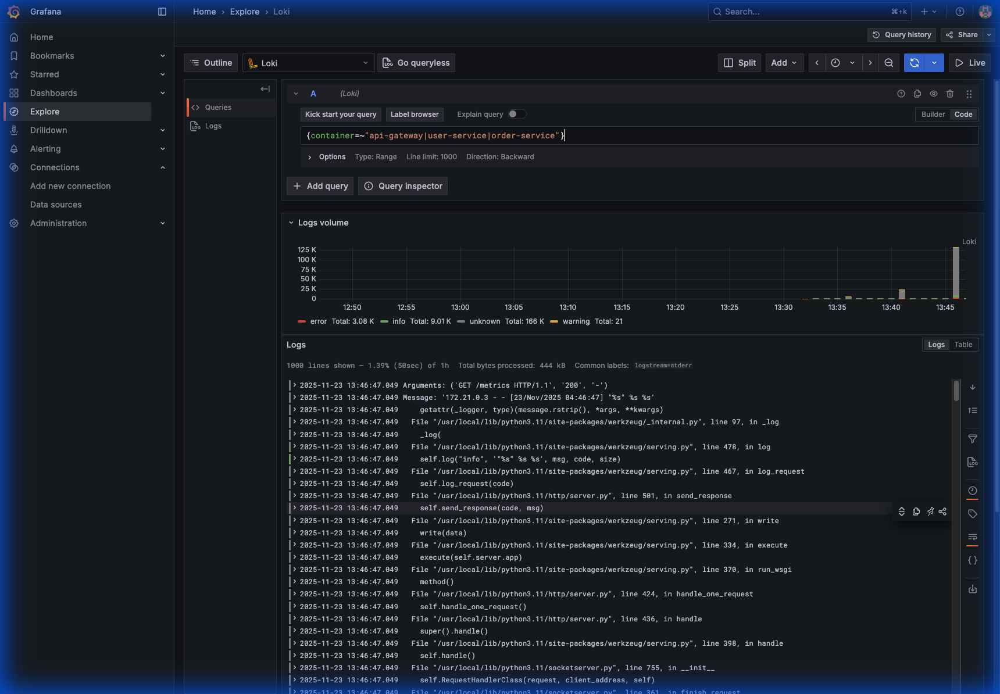
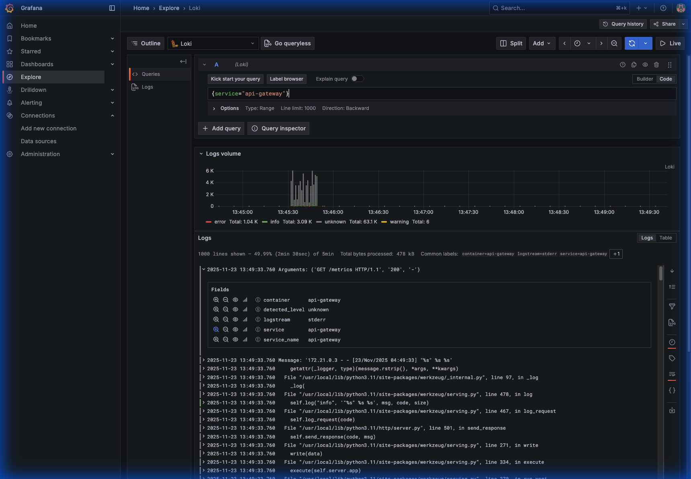
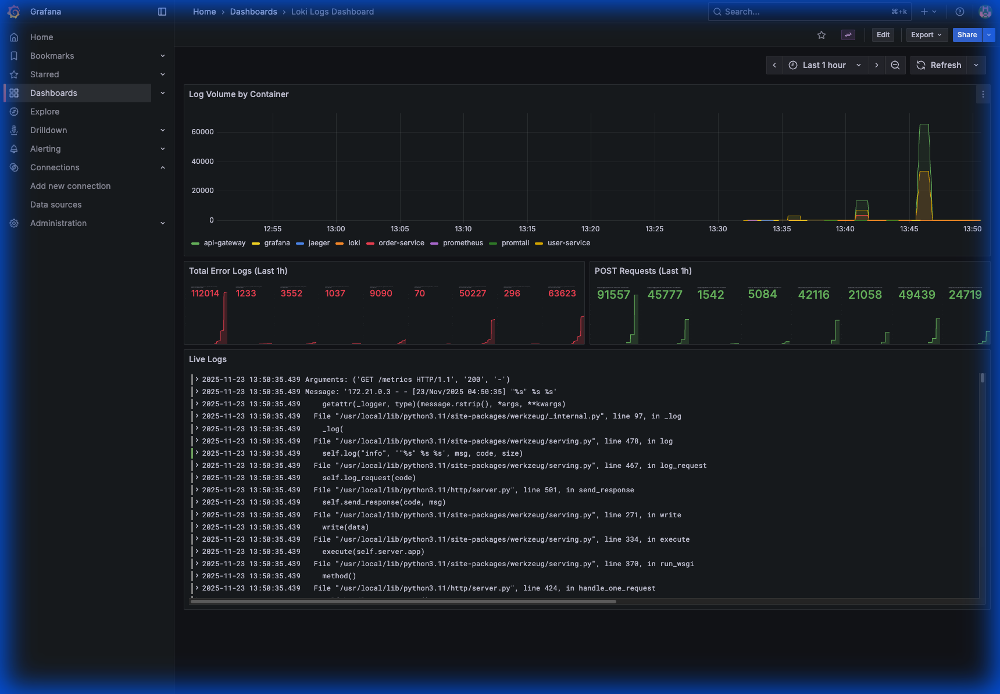

# Centralized Logging with Loki and Promtail

## 1. Introduction to the Logging Stack

In a microservices architecture, logs are scattered across multiple containers and services. Debugging requires jumping between different container logs, which is inefficient. To solve this, we implemented a **Centralized Logging** solution using the **PLG Stack** (Promtail, Loki, Grafana).

### What is Loki?
**Loki** is a horizontally scalable, highly available, multi-tenant log aggregation system inspired by Prometheus. It is designed to be very cost-effective and easy to operate.
*   **"Prometheus for Logs"**: It doesn't index the contents of the logs, but rather a set of labels for each log stream (like Prometheus labels).
*   **Storage**: It stores compressed, unstructured logs in object storage (like S3 or local filesystem) and only indexes the metadata (labels).

### What is Promtail?
**Promtail** is an agent which ships the contents of local logs to a private Loki instance or Grafana Cloud.
*   **Role**: It sits on the server (or container), discovers targets (like Docker containers), attaches labels to log streams, and pushes them to Loki.
*   **In our project**: Promtail is configured to read from the Docker socket (`/var/run/docker.sock`), automatically discovering all running containers and shipping their standard output/error logs to Loki.

---

## 2. Why is it Needed?

### The Problem
Without centralized logging:
1.  **Fragmented Data**: Logs are isolated in `docker logs <container_id>`.
2.  **No Correlation**: It's hard to match a spike in error metrics (Prometheus) with the actual error logs.
3.  **Transient Logs**: If a container crashes and is removed, its logs are lost.

### The Solution
By integrating Loki:
1.  **Unified View**: View logs from all services (API Gateway, User Service, Order Service) in a single place (Grafana).
2.  **Correlation**: You can split the screen in Grafana to see Metrics (Prometheus) and Logs (Loki) side-by-side for the same time range.
3.  **Querying**: Use **LogQL** (Log Query Language) to filter, grep, and aggregate logs (e.g., "Show me all error logs from the Order Service in the last hour").

---

## 3. Implementation Steps

We successfully integrated Loki and Promtail into the Observability Tutorial project. Here is a summary of the changes:

### Step 1: Architecture Setup
We added two new services to `docker-compose.yml`:
*   **Loki**: Listening on port `3100`.
*   **Promtail**: Mounting `/var/run/docker.sock` to scrape container logs.

### Step 2: Configuration
*   **`loki/loki-config.yml`**: Configured Loki to store logs locally.
*   **`promtail/promtail-config.yml`**: Configured Promtail to scrape Docker containers and attach labels like `container` and `service` based on Docker Compose labels.

### Step 3: Grafana Integration
*   Updated `grafana/provisioning/datasources/datasources.yml` to automatically add Loki as a datasource.

### Step 4: Dashboard Creation
We created a custom **Loki Logs Dashboard** (`logs-dashboard.json`) featuring:
*   **Log Volume**: Bar chart showing log activity per service.
*   **Error Tracker**: Count of logs containing "error".
*   **Live Logs**: Real-time stream of logs.

---

## 4. Debugging & Verification

### Initial Integration
We verified that logs were flowing by using the **Explore** view in Grafana.

### Load Testing
We generated traffic (1000 requests) to populate the logs. This confirmed that Promtail was successfully scraping logs from all our running containers (`api-gateway`, `user-service`, `order-service`).

### Troubleshooting: The "No Data" Issue
Initially, the dashboard showed "No Data".
*   **Investigation**: We inspected the raw log labels in the Explore view.
    
*   **Finding**: The dashboard queries were looking for `job="docker"`, but Promtail was attaching a `service` label (e.g., `service="api-gateway"`) derived from Docker Compose.
*   **Fix**: We updated the dashboard queries to use the `service` label.

---

## 5. Dashboard Explanation

We created a dedicated **Loki Logs Dashboard** to visualize the log data. Here is the final result:

### Dashboard Panels Explained:

1.  **Log Volume by Service (Top Panel)**
    *   **Type**: Time Series / Bar Chart
    *   **Query**: `sum(count_over_time({service=~".+"}[1m])) by (service)`
    *   **Purpose**: This shows the "rate" of logs being generated by each microservice over time. It helps identify which service is spamming logs or experiencing a spike in activity (which often correlates with traffic spikes or crash loops).

2.  **Total Error Logs (Middle Left)**
    *   **Type**: Stat / Gauge
    *   **Query**: `count_over_time({service=~".+"} |= "error" [1h])`
    *   **Purpose**: This is a quick health indicator. It counts how many log lines contain the word "error" in the last hour. A high number here immediately signals a problem that needs investigation.

3.  **POST Requests (Middle Right)**
    *   **Type**: Stat / Gauge
    *   **Query**: `count_over_time({service=~".+"} |= "POST" [1h])`
    *   **Purpose**: This tracks specific business logic or HTTP methods. In this case, we are counting how many state-changing requests (POST) are happening, which can be a proxy for business activity (e.g., Users Created, Orders Placed).

4.  **Live Logs (Bottom Panel)**
    *   **Type**: Logs
    *   **Query**: `{service=~".+"}`
    *   **Purpose**: This is the raw stream of logs. It allows you to read the actual log messages without leaving the dashboard. You can see the timestamp, the service name, and the message content. This is where you go to read the stack trace after you see a spike in the "Error Logs" panel.

---

## 6. Advantages of Loki

1.  **Cost**: Unlike ELK (Elasticsearch), Loki doesn't index the full text of logs. It only indexes labels. This makes it much smaller and cheaper to run.
2.  **Integration**: It shares the same UI (Grafana) and query language style (LogQL ~ PromQL) as Prometheus, making the learning curve shallow for existing users.
3.  **Metadata Awareness**: It automatically indexes metadata (pod names, container names, labels) which is crucial for dynamic microservices environments.
