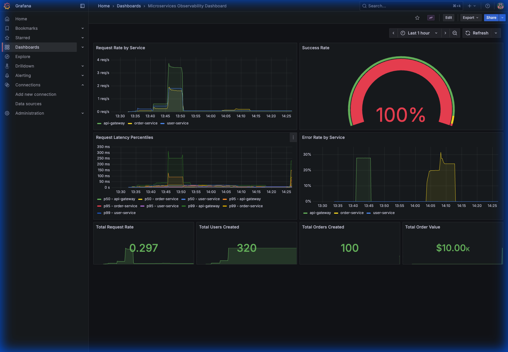
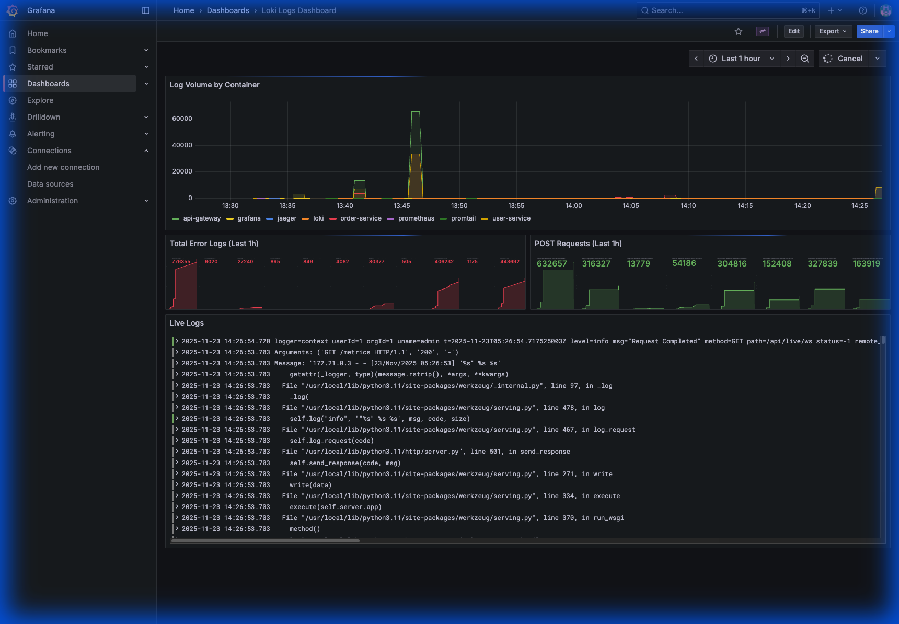
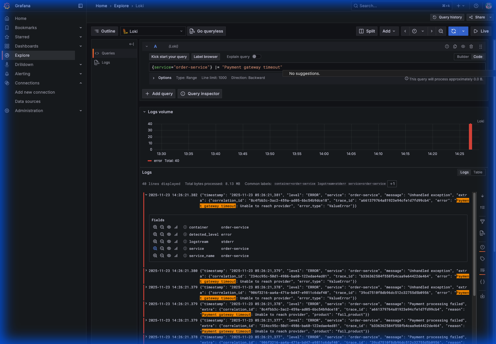

# The Complete Observability Story: Why Metrics Aren't Enough

You asked a crucial question: **"Why do we need Loki (Logs) if we already have Prometheus (Metrics) and Grafana?"**

To answer this, we need to understand the **Three Pillars of Observability**. In a complex, distributed system (like Rakuten's e-commerce platform), no single tool can tell you the whole story.

This guide explains the complete flow using an industry-standard example.

---

## 1. The Three Pillars: A Rakuten E-Commerce Example

Imagine you are an SRE (Site Reliability Engineer) at **Rakuten Ichiba**. A huge "Super Sale" is happening. Millions of users are buying items.

### Pillar 1: Metrics (Prometheus)
*   **Question**: "Is the system healthy?"
*   **What it is**: Aggregated numbers. Counts, gauges, histograms.
*   **The Scenario**: You look at your Grafana dashboard.
    *   **Alert**: "Order Service Error Rate is > 5%".
    *   **Graph**: You see a red spike. 500 out of 10,000 orders per minute are failing.
*   **Limitation**: Prometheus tells you **THAT** something is wrong and **WHEN** it started. It does *not* tell you **WHY**. It just says "500 errors". It doesn't say "User ID 123 failed because of a database lock".

### Pillar 2: Distributed Tracing (Jaeger)
*   **Question**: "Where is the problem?"
*   **What it is**: A map of a single request's journey across microservices.
*   **The Scenario**: You click on a trace for one of those failed orders.
    *   **Visual**: You see the path: `Mobile App` -> `API Gateway` -> `Order Service` -> `Payment Service` -> `Points Service`.
    *   **Finding**: The `Order Service` is green (fast), but the `Payment Service` bar is red and took 10 seconds before timing out.
*   **Limitation**: Jaeger tells you **WHERE** the bottleneck is (Payment Service). It doesn't tell you **WHAT** the specific error message was inside the code.

### Pillar 3: Logs (Loki)
*   **Question**: "What exactly happened?"
*   **What it is**: Text records of discrete events. "Error: Connection refused", "User logged in", "Payment declined".
*   **The Scenario**: You query Loki for logs from the `Payment Service` at the exact time the trace failed.
    *   **Query**: `{service="payment-service"} |= "error"`
    *   **Result**: `[Error] Connection timeout: Unable to reach external Credit Card Provider API at 192.168.1.55`.
*   **Conclusion**: The external banking API is down. It's not a code bug in Rakuten's system; it's a vendor outage.

---

## 2. Why Prometheus Alone Fails

If you only had Prometheus:
1.  You would see "Error Rate High".
2.  You would guess: "Is it the database? Is it the code? Is it the network?"
3.  You would SSH into servers randomly to `tail -f` logs (impossible with 1000 containers).
4.  You wouldn't know *which* service was actually responsible for the delay.

**Loki is the "Microscope" to Prometheus's "Telescope".**
*   **Prometheus**: "The forest is on fire." (High level, cheap storage, fast).
*   **Loki**: "This specific tree was struck by lightning." (Low level, heavy detail, context).

---

## 3. The "Rakuten Stack" Workflow

Here is how a modern tech giant typically architects this flow.

| Layer | Tool | Role | Example Query |
| :--- | :--- | :--- | :--- |
| **Visualization** | **Grafana** | The Single Pane of Glass. Combines all three below. | *Dashboard showing Error Rate (Metrics) next to Error Logs (Loki).* |
| **Metrics** | **Prometheus** | **Detection**. Triggers the pager. | `rate(http_requests_total{status="500"}[5m]) > 0.05` |
| **Tracing** | **Jaeger / Tempo** | **Isolation**. Finds the failing microservice. | `TraceID: 12345` -> Shows span duration for `Payment Service`. |
| **Logging** | **Loki** | **Diagnosis**. Finds the root cause. | `{app="payment"} |= "timeout" |= "traceID=12345"` |

### The "Exemplar" Feature
Modern Grafana allows you to link these tightly:
1.  **Hover** over a spike in the Prometheus graph.
2.  **Click** "View Trace" (Grafana passes the TraceID from the metric to Jaeger).
3.  **View** the Trace waterfall. Spot the red bar.
4.  **Click** the red bar. Click "Logs for this span" (Grafana passes the TraceID to Loki).
5.  **Read** the exact error log.

**Total Time to Debug**: 30 seconds.
**Time without Observability**: Hours.

---

## 4. Practical Example: Debugging a Payment Failure

We simulated a real-world failure in our `Order Service` to demonstrate this workflow. We introduced a bug where ordering a specific product (`fail_product`) causes a "Payment Gateway Timeout".

Here is the step-by-step evidence of how we caught it:

### Step 1: Detection (Metrics)
The **Microservices Dashboard** alerted us to a problem. We saw a sudden spike in the **Error Rate** for the Order Service. This is our "Smoke Alarm".

### Step 2: Diagnosis (Logs Dashboard)
We switched to the **Loki Logs Dashboard**. We immediately saw a corresponding spike in the "Total Error Logs" panel. The "Live Logs" panel started showing red error messages, confirming that the errors were happening *now*.

### Step 3: Root Cause Analysis (Explore)
We drilled down into the logs using the **Explore** view. By filtering for the `order-service` and the error message, we found the exact cause: **"Payment gateway timeout: Unable to reach provider"**.

This confirms that the issue is a timeout connecting to the payment provider, not a database error or a logic bug in the user service.

---

## 5. Summary: The Full Picture

| Feature | Prometheus (Metrics) | Loki (Logs) | Jaeger (Tracing) |
| :--- | :--- | :--- | :--- |
| **Data Type** | Numbers (Counters, Gauges) | Text (Lines of text) | Spans (Time ranges & relationships) |
| **Question** | "Is it fast? Is it broken?" | "Why is it broken?" | "Which service is slow?" |
| **Volume** | Low (Aggregated) | High (Every event) | Medium (Sampled requests) |
| **Cost** | Cheap | Expensive | Moderate |
| **Rakuten Analogy** | "Sales are down 10%." | "Customer ID 555's credit card was declined." | "The customer got stuck at the 'Confirm Payment' screen." |

You need **Loki** because metrics are anonymous. Metrics tell you *trends*. Logs tell you *stories*. You cannot fix a bug with a trend; you need the story.
